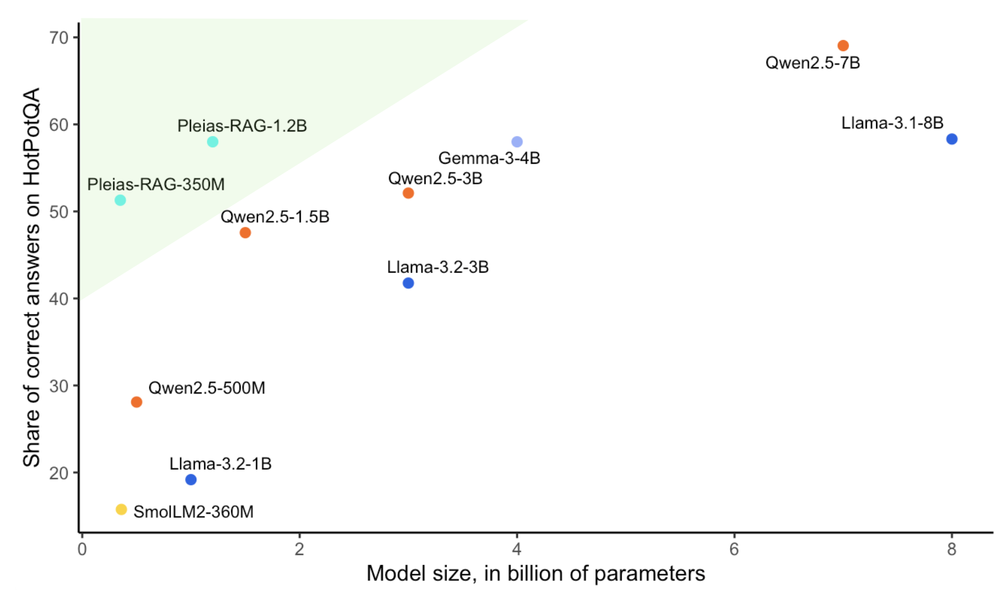

# Pleias-RAG-Library

A library for API interaction with custom Pleias RAG models that generate high-quality, factual responses backed up by literal quotations. Currently this includes two models:
* [Pleias-RAG-350M](https://huggingface.co/PleIAs/Pleias-RAG-350M), a phone-sized SLM with 350 million parameters.
* [Pleias-RAG-1B](https://huggingface.co/PleIAs/Pleias-RAG-1B), a 1.2B parameters SLM.

Pleias-RAG-Library was developed by Mattia Nee. This repository contains detail and documentations about the library. A [Colab notebook](https://colab.research.google.com/drive/1oG0qq0I1fSEV35ezSah-a335bZqmo4_7?usp=sharing) is available for easy tests and experimentations.

For more information about the models, their training and their expected performance, please refer to the [model card](https://github.com/Pleias/Pleias-RAG-Library/blob/main/Pleias_RAG_Model_Family.pdf).

<p align="center">
  
</p>

## Table of Contents
- [Features](#features)
- [Installation](#installation)
- [Quick Start](#quick-start)
- [Input Format](#input-format)
- [Output Structure](#output-structure)
- [Response Sections](#response-sections)
- [Citation System](#citation-system)
- [Model Management](#model-management)
- [Advanced Usage](#advanced-usage)
- [Implementation Details](#implementation-details)

## Features

- **Dual Backend Support**: Automatically uses vLLM for GPU acceleration or falls back to Transformers for CPU
- **Structured Outputs**: Generates responses with clearly organized sections (analysis, draft, final answer)
- **Automated Citations**: Tracks and formats citations from source documents
- **Metadata Management**: Preserves source document metadata
- **JSON Export**: Provides structured responses for seamless integration
- **Model Management**: Supports predefined models with automatic downloading functionality

## Installation

To be completed when the library is put somewhere

## Quick Start

```python
# Initialize with your preferred model
rag = RAGWithCitations("/path_to_pleias_model")

# Or use a predefined model with automatic downloading
rag = RAGWithCitations("1b_rag", hf_token="your_huggingface_token")

# Define query and sources
query = "What is the capital of France?"
sources = [
    {
        "text": "Paris is the capital and most populous city of France.",
        "metadata": {"source": "Geographic Encyclopedia", "reliability": "high"}
    },
    {
        "text": "The Eiffel Tower is located in Paris, France.",
        "metadata": {"source": "Travel Guide", "year": 2020}
    }
]

# Generate a response
response = rag.generate(query, sources)

# Print the final answer with citations
print(response["processed"]["clean_answer"])
```

## Input Format

### Query
A string containing the user's question:
```python
query = "What is the capital of France?"
```

### Sources
A list of dictionaries with required `text` and optional `metadata`:

```python
sources = [
    {
        "text": "Document content here...",
        "metadata": {  # Optional dictionary of metadata
            "source": "Wikipedia",
            "last_updated": "2023-04-15",
            "author": "John Doe"
        }
    }
]
```

## Output Structure

The `generate()` method returns a dictionary with this structure:

```python
{
    "raw_response": "Full unprocessed model output",
    "processed": {
        # Extracted sections (see Response Sections below)
        "language": "Analysis of query language",
        "query_report": "Report about the query",
        "source_analysis": "Analysis of provided sources",
        "draft": "Draft response",
        "answer": "Final answer with citation markers",
        "clean_answer": "Readable answer with formatted citations",
        "citations": [  # List of extracted citations
            {
                "citation_number": 1,
                "source_id": "1",
                "cited_text": "Text that was cited",
                "supported_text": "Context surrounding citation"
            }
        ]
    },
    "backend_used": "vllm or transformers"
}
```

If no sections are found in the response, the `processed` dictionary will contain only a `full_text` field with the complete unprocessed text.

## Response Sections

The model response is divided into structured sections:

| Section | Description | Tags |
|---------|-------------|------|
| `language` | Analysis of query language | `<\|language_start\|>` to `<\|language_end\|>` |
| `query_report` | Analysis of the query | `<\|query_report_start\|>` to `<\|query_report_end\|>` |
| `source_analysis` | Analysis of source documents | `<\|source_analysis_start\|>` to `<\|source_analysis_end\|>` |
| `draft` | Draft response | `<\|draft_start\|>` to `<\|draft_end\|>` |
| `answer` | Final answer with citations | `<\|answer_start\|>` to `<\|answer_end\|>` |

## Citation System

### Format
Citations in the raw model output use this format:
```
<ref name="<|source_id|>NUMBER">cited text</ref>
```

Where `NUMBER` is the source number (1-based index).

### Processing
The library:
1. Extracts all citation tags from the response
2. Replaces each tag with a numbered reference like `[1]`
3. Captures surrounding context (up to 150 characters)
4. Adds a formatted citations section at the end

### Example Output

```
The capital of France is Paris[1]. It is the most populous city in France[1] and serves as the center of French economic, political, and cultural life.

**Citations**
[1] "Paris is the capital and most populous city of France." [Source 1]
```

## Model Management

### Predefined Models

The library supports using predefined models by name, which will be automatically downloaded:

```python
# Use a predefined model with automatic downloading
rag = RAGWithCitations(
    model_path_or_name="1b_rag",  # Predefined model name
    hf_token="your_huggingface_token",  # Required for downloading
    models_dir="./custom_models_dir"  # Optional, default is "./pleias_models"
)
```

Currently available predefined models:
- `"1b_rag"`: Maps to `"PleIAs/1b_rag_traceback"`

### Model Download Process

When using a predefined model name:
1. The library checks if the model name is in the list of available models
2. It attempts to download the model using the provided Hugging Face token
3. The model is saved to the specified directory (default: `./pleias_models`)
4. If download is successful, the local path is used; otherwise, it falls back to using the model name directly

## Advanced Usage

### Processing JSON Requests

```python
request_json = {
    "query": "What is the capital of France?",
    "sources": [
        {
            "text": "Paris is the capital of France.",
            "metadata": {"source": "Encyclopedia"}
        }
    ]
}

# Process request and get structured response
response = rag.process_request(request_json)

# Convert to JSON string if needed
json_string = rag.to_json(response)
```

The response structure from `process_request()` is:
```python
{
    "query": "Original query",
    "sources_used": [
        {
            "id": 1,
            "metadata": {...}  # Source metadata (empty dict if none provided)
        }
    ],
    "raw_response": "Full unprocessed model output",
    "processed_response": {
        # Same structure as the "processed" field from generate()
    },
    "backend_used": "vllm or transformers"
}
```

### Customizing Generation Parameters
It is recommended to use the default parameters, as the models are optimized for them.
```python
rag = RAGWithCitations(
    model_path="your-model-path",
    max_tokens=2048,        # Maximum tokens to generate (default: 2048)
    temperature=0.0,        # Sampling temperature (default: 0.0)
    top_p=0.95,             # Nucleus sampling parameter (default: 0.95)
    repetition_penalty=1.0, # Penalty to reduce repetition (default: 1.0)
    trust_remote_code=True, # Whether to trust remote code (default: True)
    hf_token="your_token",  # Required for downloading predefined models
    models_dir="./models"   # Custom directory for downloaded models
)
```

## Implementation Details

### Prompt Format
The library constructs a prompt with special tokens:

```
<|query_start|>User question here<|query_end|>
<|source_start|><|source_id|>1 Source document text here<|source_end|>
<|source_start|><|source_id|>2 Another source document text<|source_end|>
<|language_start|>
```

### Backend Selection
The library automatically selects between:
- **vLLM**: Used when CUDA is available for faster processing
- **Transformers**: Used as a fallback when running on CPU-only systems

The backend selection is transparent to the user, but can be identified in the response via the `backend_used` field.
